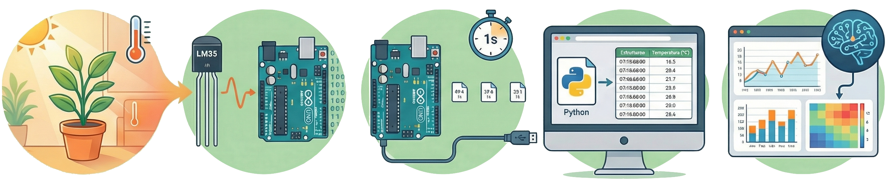

# Datafication – Arduino + LM35

Este repositório contém um experimento de dataficação que converte a temperatura ambiente em dados digitais usando um Arduino (BlackBoard UNO R3 compatível) e o sensor LM35, com armazenamento das leituras em arquivo CSV para análises posteriores.

## Visão geral

O projeto demonstra o ciclo completo de dataficação aplicado a um fenômeno físico (temperatura):

- Captura contínua da temperatura com o sensor LM35.
- Conversão do sinal analógico pelo Arduino.
- Envio dos dados pela porta serial.
- Leitura da serial via Python e gravação automática em arquivo CSV com timestamp.

## Materiais utilizados

- Placa BlackBoard UNO R3 (compatível com Arduino Uno)
- Sensor de temperatura LM35
- Protoboard e cabos jumper
- Computador com Arduino IDE
- Script em Python para leitura da porta serial e gravação em CSV

## Montagem do circuito

Conexões básicas do LM35:

- VCC → 5V
- GND → GND
- Sinal → A0 (entrada analógica)

## Estrutura do repositório

- `lm35_temperature.ino` – sketch responsável por ler o LM35 e enviar as leituras pela serial.
- `serial_to_csv.py` – script que escuta a porta serial, adiciona timestamp e grava em um arquivo `.csv`.
- `dados.csv` – saída com leituras coletadas.

## Fluxo de funcionamento

1. O Arduino lê periodicamente a temperatura a partir do LM35.
2. Os valores são enviados pela porta serial em intervalos regulares (por exemplo, a cada 1 segundo).
3. O script Python lê cada valor da serial, anexa o horário de coleta (timestamp) e salva em um arquivo CSV estruturado.
4. O CSV gerado pode ser usado em ferramentas de BI ou notebooks para visualização de gráficos e análises exploratórias.

## Possíveis extensões

- Criar dashboards (Power BI, Metabase ou notebooks) para visualizar a variação de temperatura ao longo do tempo.
- Integrar outros sensores (umidade, luminosidade etc.) ao processo de dataficação.
- Aplicar modelos de IA para detecção de padrões e anomalias nos dados coletados.

## Licença

MIT
